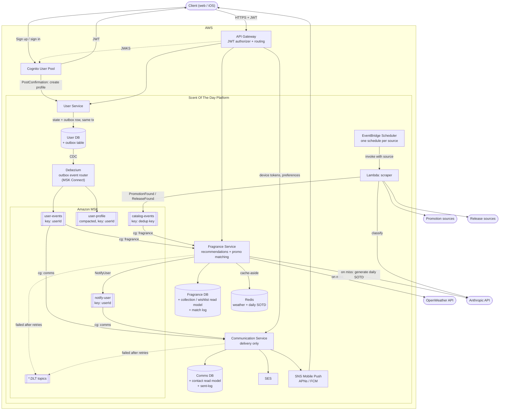

```mermaid
flowchart TB
    CLIENT(["Client (web / iOS)"])

    subgraph AWS["AWS"]
        COGNITO["Cognito User Pool"]
        API_GATEWAY["API Gateway<br/>JWT authorizer + routing"]

        subgraph PLATFORM["Scent Of The Day Platform"]
            USER["User Service"]
            FRAGRANCE["Fragrance Service<br/>recommendations + promo matching"]
            COMMS["Communication Service<br/>delivery only"]

            USERDB[("User DB<br/>+ outbox table")]
            FRAGRANCEDB[("Fragrance DB<br/>+ collection / wishlist read model<br/>+ match log")]
            COMMSDB[("Comms DB<br/>+ contact read model<br/>+ sent-log")]
            REDIS[("Redis<br/>weather + daily SOTD")]

            DEBEZIUM["Debezium<br/>outbox event router<br/>(MSK Connect)"]

            subgraph MSK["Amazon MSK"]
                USER_EVENTS[["user-events<br/>key: userId"]]
                USER_PROFILE[["user-profile<br/>compacted, key: userId"]]
                CATALOG_EVENTS[["catalog-events<br/>key: dedup key"]]
                NOTIFY_USER[["notify-user<br/>key: userId"]]
                DLT[["*.DLT topics"]]
            end

            EVENTBRIDGE["EventBridge Scheduler<br/>one schedule per source"]
            SCRAPER["Lambda: scraper"]
            SES["SES"]
            PUSH["SNS Mobile Push<br/>APNs / FCM"]
        end
    end

    OPENWEATHER(["OpenWeather API"])
    ANTHROPIC(["Anthropic API"])
    PROMOTIONS(["Promotion sources"])
    RELEASES(["Release sources"])

    CLIENT -->|"Sign up / sign in"| COGNITO
    COGNITO -->|"JWT"| CLIENT
    COGNITO -->|"PostConfirmation: create profile"| USER
    CLIENT -->|"HTTPS + JWT"| API_GATEWAY
    API_GATEWAY -.->|"JWKS"| COGNITO

    API_GATEWAY --> USER
    API_GATEWAY --> FRAGRANCE
    API_GATEWAY -->|"device tokens, preferences"| COMMS

    USER -->|"state + outbox row, same tx"| USERDB
    USERDB -->|"CDC"| DEBEZIUM
    DEBEZIUM --> USER_EVENTS
    DEBEZIUM --> USER_PROFILE

    FRAGRANCE --> FRAGRANCEDB
    FRAGRANCE -->|"cache-aside"| REDIS
    FRAGRANCE -->|"on miss"| OPENWEATHER
    FRAGRANCE -->|"on miss: generate daily SOTD"| ANTHROPIC

    EVENTBRIDGE -->|"invoke with source"| SCRAPER
    SCRAPER --> PROMOTIONS
    SCRAPER --> RELEASES
    SCRAPER -->|"classify"| ANTHROPIC
    SCRAPER -->|"PromotionFound / ReleaseFound"| CATALOG_EVENTS

    USER_EVENTS -->|"cg: fragrance"| FRAGRANCE
    CATALOG_EVENTS -->|"cg: fragrance"| FRAGRANCE
    FRAGRANCE -->|"NotifyUser"| NOTIFY_USER

    USER_EVENTS -->|"cg: comms"| COMMS
    NOTIFY_USER -->|"cg: comms"| COMMS

    FRAGRANCE -.->|"failed after retries"| DLT
    COMMS -.->|"failed after retries"| DLT

    COMMS --> COMMSDB
    COMMS --> SES
    COMMS --> PUSH
    PUSH --> CLIENT
```